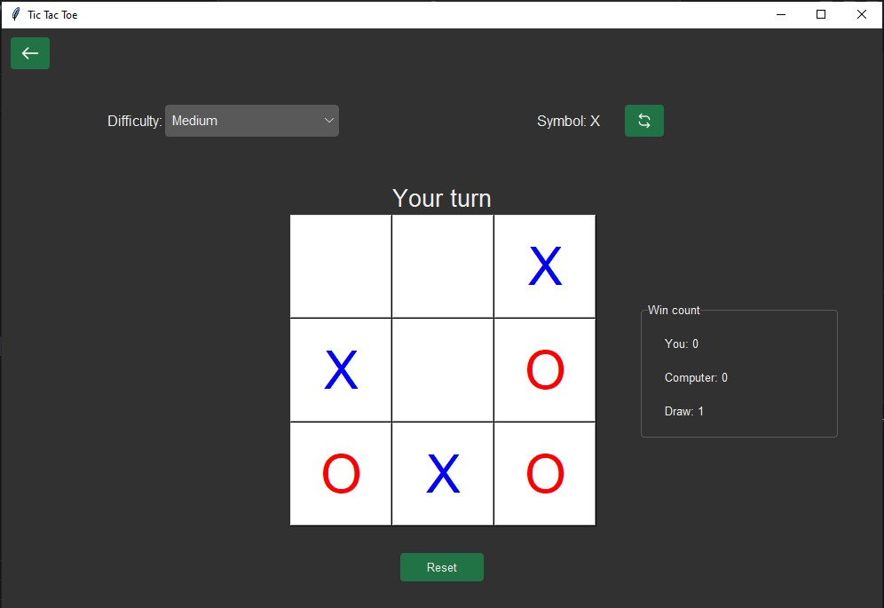

# Tic-tac-toe Python



This is a simple implementation of the Tic-tac-toe game in Python.

## How to Play

- Players take turns to place their mark (X or O) on a 3x3 grid.
- The first player to get three of their marks in a row (horizontally, vertically, or diagonally) wins the game.
- If all spaces on the board are filled without any player winning, the game ends in a draw.

## Requirements

- Python 3.x

## Installation

### 1. Clone the repository:
```bash
git clone https://github.com/hoanganh-p/Tic-tac-toe-python.git
```
### 2. Navigate to the project directory:
```bash
cd Tic-tac-toe-python
```
### 3. Create a virtual environment:
- **For Windows:**
```bash
python -m venv venv
.\venv\Scripts\activate
```
- **For Linux:**
```bash
python3 -m venv venv
source venv/bin/activate
```

### 4. Install the required dependencies:
```bash
pip install -r requirements.txt
```
### 5. Run the program
```bash
python home.py
```

## Contributing

Pull requests are welcome. For major changes, please open an issue first to discuss what you would like to change.

## License

This project is licensed under the MIT License - see the [LICENSE](LICENSE) file for details.
